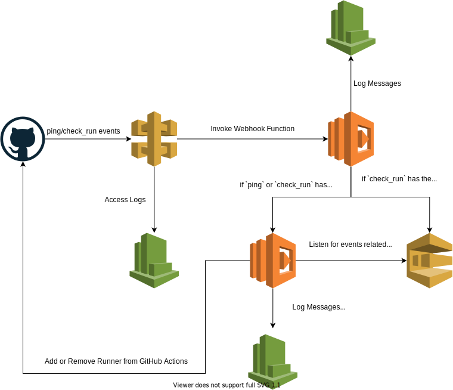

# Lambda GitHub Runner
A completely serverless way to have simple self-hosted runners for GitHub Actions.  Lightweight, fast and easy to deploy.

## Why it was built
Once [Lambda Containers](https://aws.amazon.com/blogs/aws/new-for-aws-lambda-container-image-support/) came out, I wanted to see how far they could go.  I know there is already a serverless way of doing Github Runners with AWS Fargate, but if you can do it all in Lambda why not?

I also wanted to develop a way to do the last "job" in my actions in my own environment.  This way, I could assign the AWS permissions to the lambda function and not have to rotate keys in GitHub, just use IAM roles.

## How it Works
Using GitHub webhooks, we listen for the `check_run` event and then start up a runner when it's needed.  This is now possible through [Lambda Containers](https://aws.amazon.com/blogs/aws/new-for-aws-lambda-container-image-support/).  It uses a few different AWS services to make this possible.

 - Lambda (obviously)
    - `lambda-github-webhook` - This function handles the incoming webhooks to start/stop/setup runners
    - `lambda-github-runner` - This function is the actual self-hosted runner!
 - API Gateway
    - Gives you an endpoint for the GitHub webhooks
 - SQS
    - Used to "stop" the self-hosted runners in lambda when the action is complete
 - ECR
    - You are required to host the docker image in your own account for lambda (copies from public ECR repository)
 - Cloudwatch
    - All applications need logging, even if it's simple

Using the lifecycle of an action and the `check_run` webhook, we are able to dynamically add/remove self-hosted runners from GitHub as they are needed.

## Deployment Overview

### Generate a GitHub Token
A GitHub token is required to setup the project.  This token just needs `repo` access.  It is used to generate GitHub Runner tokens used to add/remove the runners.

### How to Deploy
This project includes a Terraform so you can essentially set this up in your environment with little to no effort.  It uses the AWS credentials on your machine and pulls the lambda functions (`.zip` and docker image) from a public source, so you don't have to build locally (but you can if you want).  You will need the following on your machine to get started

 - Terraform
 - AWS CLI v2 (yes, v2 is important)
 - Docker (to pull and push the images)

Once you have everything above installed, just clone this repo, navigate to the `deploy` folder and run

`terraform init`

then

`terraform plan`

There are a number of variables you can provide before building to customize it in your account (listed below).  Once you feel confortable about what it is setting up, just run the final command

`terraform apply`

Once it is successfully deployed, it will output your webhook URL (generated by API Gateway).  This is what you will bring to your GitHub repository to setup webhooks.

### Setting up GitHub Webhooks
Once you have the project deployed in your AWS account, you just need to setup the webhook endpoint (provided at the end of the terraform process) in the GitHub repository you wish to have use the runners.

Go to the GitHub repository and select "Settings" -> "WebHooks".  You will see an option to "Add webhook".  Enter and change the following information.

 - Payload URL: The URL you got from the terraform script
 - Content Type: Change to "application/json"
 - Secret: Only enter if you set one up when deploying to AWS
 - "Which events would you like to trigger this webhook?": Select "Let me select individual events" and make sure just "check_run" is selected (by default, just "push" is selected).  Other events are automatically ignored, but there is no sense in sending extra data.

 Once all this is entered, go ahead and create the webhook!  The first delivery you should see is a "ping" event.  This is to test the webhook and make sure everything is ok.  If it returns a `200`, then you are good to go!

 Something to note is that to make sure an Action doesn't fail, a self-hosted runner **MUST** be setup (even if it's not running).  If none are setup, the action will just fail rather they "wait" for an available runner.  We use the "ping" event to setup a default runner called "DEFAULT-LAMBDA-DO-NOT-REMOVE".  This should never be "active", but is used as a place holder to ensure that your actions don't immediately fail.  All other runners will have a unique name and be short lived.

 ** Note that it is possible to accidently remove the default runner if you run an action immediately after setting it up.  Please give it some time for the lambda function to become "cold" so that a new one is used (removing the other action) **

## Known Limitations
 - GitHub Action steps that need Docker will **NOT** work.  [Lambda Containers](https://aws.amazon.com/blogs/aws/new-for-aws-lambda-container-image-support/) currently don't support "docker-in-docker"
 - You only have 15 minutes to complete the job.  Lambda functions timeout after that. (You can configure in the deployment for them to timeout sooner)

## More to Come
I do have some future plans for this project, including supporting a hidden "configuration" file in the repoistory (like how GitHub does workflows in `.github`) to configure more aspects of the runner and maybe even use "AWS Fargate" over Lambda in certain cases due to a longer execution time or some other variable.  Open to ideas!